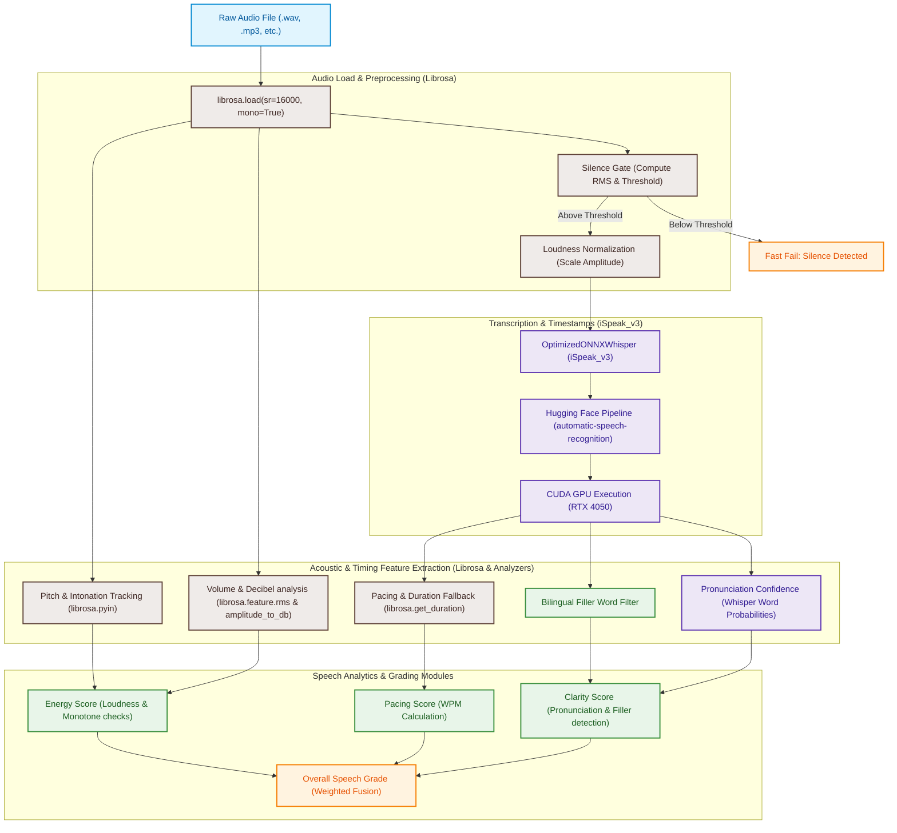

# Architecture & Integration: iSpeak_v3 Model and Librosa Connection

---

## Option 1: High-Resolution Diagram Image
Here is a premium, high-resolution diagram generated specifically for your thesis or presentation. 

**How to copy:** You can right-click the image below and select **"Save image as..."** or **"Copy image"** to paste it directly into Microsoft Word, PowerPoint, or your LaTeX editor!


---

## Option 2: Copy-Pasteable Unicode / Text Diagram
If you want to paste the diagram as plain text into a text document, email, or draft, you can highlight and copy the box below:

```text
               ┌──────────────────────────────┐
               │    Raw Audio Recording       │
               └──────────────┬───────────────┘
                              │
              ┌───────────────┴───────────────┐
              ▼                               ▼
┌───────────────────────────┐   ┌───────────────────────────┐
│         Librosa           │   │      iSpeak_v3 Model      │
│ (Acoustic Sound Analysis) │   │ (AI Speech Transcription) │
└─────────────┬─────────────┘   └─────────────┬─────────────┘
              │                               │
              ▼                               ▼
┌───────────────────────────┐   ┌───────────────────────────┐
│     Acoustic Grades       │   │       Speech Grades       │
│  (Volume & Monotone Lvl)  │   │  (WPM, Fillers, Clarity)  │
└─────────────┬─────────────┘   └─────────────┬─────────────┘
              │                               │
              └───────────────┬───────────────┘
                              ▼
               ┌──────────────────────────────┐
               │  Overall Score & Grading     │
               └──────────────────────────────┘
```

---

## Option 3: Raw Mermaid Code Block
If you are using a Markdown-compatible viewer (like Notion, GitHub, or Obsidian) or the [Mermaid Live Editor](https://mermaid.live), copy this code block:

```text
graph TD
    classDef main fill:#f0f4c3,stroke:#afb42b,stroke-width:2px,color:#33691e;
    classDef librosa fill:#efebe9,stroke:#5d4037,stroke-width:2px,color:#3e2723;
    classDef model fill:#ede7f6,stroke:#5e35b1,stroke-width:2px,color:#311b92;
    classDef score fill:#fff3e0,stroke:#f57c00,stroke-width:2px,color:#e65100;

    A["Raw Audio Recording"]:::main --> B["Librosa<br>(Acoustic Sound Analysis)"]:::librosa
    A --> C["iSpeak_v3 Model<br>(AI Speech Transcription)"]:::model

    B -->|Detects volume, loudness, and pitch variation| D["Acoustic Grades<br>(Volume & Monotone Level)"]:::score
    C -->|Detects words, word confidence, and duration| E["Speech Grades<br>(WPM, Filler Words, & Pronunciation)"]:::score

    D --> F["Overall Speech Score & Grading"]:::main
    E --> F

    class A,F main;
    class B librosa;
    class C model;
    class D,E score;
```

---

## 4. Deep-Dive Technical Architectural Flow

If you need to inspect the precise internal function calls and low-level script dependencies, here is the full pipeline:



---

## 5. Deep-Dive Integration Details

The connection between **iSpeak_v3** and **Librosa** is non-linear and synergistic; Librosa acts as both a **preprocessing gatekeeper** and a **parallel acoustic analyzer** that supplements Whisper's textual transcripts.

### Preprocessing & Gatekeeping (Librosa)
Before the audio is processed by the heavy neural networks of the Whisper model, Librosa performs the initial load and sanitizes the input:
1. **Resampling and Mono Conversion**: `librosa.load(file_path, sr=16000, mono=True)` standardizes the audio sample rate to `16,000 Hz` (matching Whisper's expected input dimension) and collapses stereo tracks into a single channel.
2. **Silence Gating**: The root-mean-square (RMS) energy is computed:
   $$\text{RMS} = \sqrt{\frac{1}{N}\sum_{i=1}^N y_i^2}$$
   If $\text{RMS} < 10^{-4}$ (equivalent to silence/blank recording), the system terminates the process early, bypassing the GPU transcription pipeline and immediately returning a score of `0` to optimize system performance.
3. **Loudness Normalization**: To prevent volume-induced hallucinations or transcription errors, the amplitude array is normalized to a fixed base RMS value of `0.05`:
   $$y_{\text{normalized}} = y \times \left(\frac{0.05}{\text{RMS}}\right)$$

### Transcription & Boundary Extraction (iSpeak_v3 ONNX)
Once sanitized, the audio file is sent to the custom **iSpeak_v3** ONNX pipeline:
* It executes transcription on the **GPU (CUDAExecutionProvider)** using Whisper's transformer architecture.
* It leverages phrase-level timestamps (`return_timestamps=True`) to approximate boundaries for individual words.
* It outputs:
  * Word tokens.
  * Start and end timestamps (e.g., `word_start`, `word_end`).
  * Acoustic probability/confidence scores (`probability`).

### Acoustic Analytics & Feature Tracking (Librosa)
While Whisper extracts textual data, **Librosa** runs parallel acoustic feature analyses over the raw audio array `y` to grade the speech delivery:
* **Energy (Loudness) Grading**:
  * Librosa computes frame-by-frame RMS energy using `librosa.feature.rms()`.
  * Amplitudes are mapped to decibels with `librosa.amplitude_to_db()`.
  * The average volume is categorized as **Whispering** ($<-30\text{ dB}$), **Shouting** ($>-7\text{ dB}$), or **Normal**.
* **Pitch & Tone (Monotone Detection)**:
  * Librosa utilizes the **pYIN algorithm** (`librosa.pyin`) to estimate the fundamental frequency ($F_0$) pitch contours.
  * Search range bounds are constrained to typical human speech ($C_2 \approx 65\text{ Hz}$ to $C_7 \approx 2093\text{ Hz}$) using `librosa.note_to_hz()`.
  * The standard deviation of voiced $F_0$ frames is calculated. If the variance is $< 20\text{ Hz}$, the speech is flagged as **monotone** (flat, robotic tone).

### Fusion & Joint Calculation
The final grading combines outputs from both modules:
1. **Pacing (WPM)**: Combines the **Whisper word list count** with the **Librosa duration** (`librosa.get_duration`) fallback to compute accurate Words-Per-Minute.
2. **Clarity**: Fuses the Whisper token confidence level with a dictionary-based bilingual filler word detector to evaluate pronunciation quality.
3. **Energy**: Grades loudness variation and pitch standard deviation.
4. **Overall Score**: Weighted average of Clarity ($40\%$), Pacing ($35\%$), and Energy ($25\%$).
